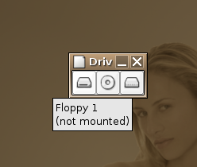

I started to look at bringing the drive mount applet from `gnome-applts`
up to scratch, since it hasn\'t really had much work done on it other
than porting to the 2.x development platform.

The applet is a classic example of Gnome 1.x user interface complexity.
The applet shows a button that can be clicked to mount or unmount a
particular mount point. For this simple functionality, it provides the
following preferences:

-   The mount directory
-   The interval at which to check the mounted state
-   Which of a set of custom images to use to show the mounted state
    (eg. floppy drive, cdrom drive, etc).
-   The ability to specify custom mounted/unmounted images.
-   Whether to eject the disk after unmounting.
-   Whether to use a second method for checking the mounted state which
    might work better with automounters.

The applet also had a few problems, such as not being able to unmount a
disk if there was a trash directory on it (since fam would have a
dnotify watch active on that directory).

By using some of the newer gnome-vfs APIs, I think it should be possible
to remove all the preferences:

1.  The `GnomeVFSVolumeManager` API can be used to get a list of
    attached drives and volumes, and receive notification when volumes
    are mounted or new drives are connected or disconnected. This allows
    one applet to display the status of all user (un)mountable
    drives/volumes in one applet.
2.  By using the gnome-vfs APIs to unmount or eject a volume, a
    `volume_pre_unmount` signal to interested applications before
    attempting to unmount it. When Nautilus receives this signal, it
    drops its FAM watches on the trash directory for that volume, and
    closes all associated windows. This means that Nautilus/FAM won\'t
    cause a \"volume is busy\" error (although some other apps might
    hold files opne on the volume).
3.  The gnome-vfs APIs tell us what the volume type is. This way we can
    automatically do an unmount+eject for cdrom, zip and jaz drives like
    Nautilus does rather than having to provide a preference.
4.  Gnome-vfs also tells us what icon name should be used for a
    particular drive or volume. This way the applet can just pull the
    icons from the current icon theme rather than having to maintain
    separate ones.

My code is at the point where it produces [nice
screenshots](drive-mount.png), and has the above features. The
screenshot shows it as a separate window, but adding the applet
wrapper stuff isn\'t too difficult (it is easier to test as a
standalone app). It is less than half the size of the old applet too,
which is promising.

