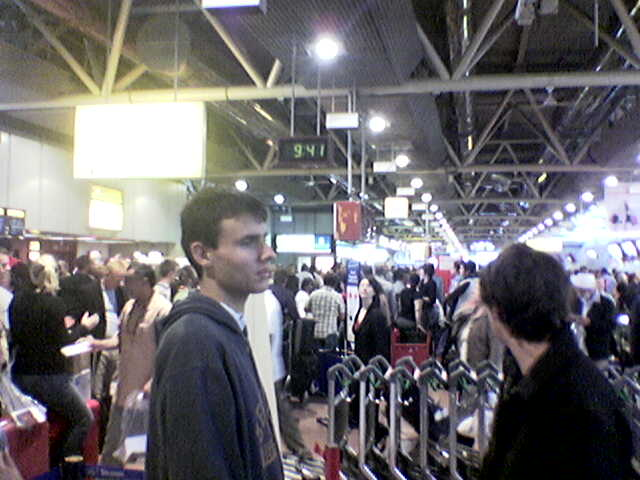
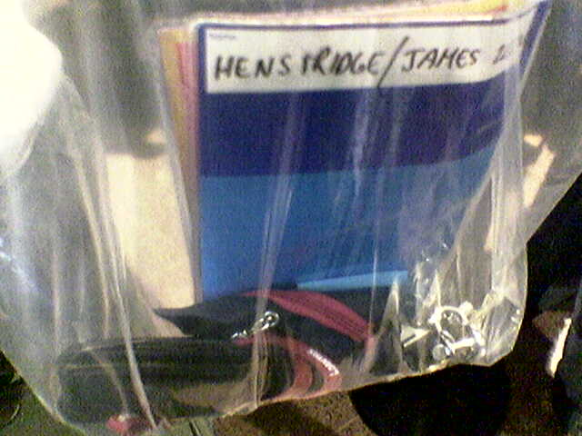
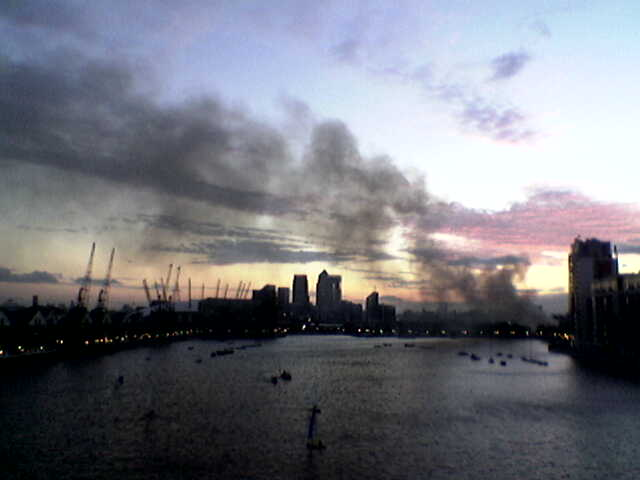

I got back from London on Sunday from the
[Launchpad](https://launchpad.net/) infrastructure sprint. Because of
the terrorism scare, Heathrow was chaos (more so than usual). The bus
service from the tube station to Terminal 4 ended up in a traffic jam.
There were a lot of people milling around outside the terminal who were
not being allowed in because they\'d arrived too early (it was around
9am, and some of them had afternoon flights).

It took a while to find the end of the checkin queue because another
queue (passport control) had extended in front of it. I got to the end
of this other queue and was told that I needed to go to the other end of
the terminal section to queue up. After an hour or so, I got to the head
of the queue and was able to check in my luggage, saying good bye to my
laptop, phone and other stuff I\'d normally be carrying on board. I\'d
padded my bag with a few pillows and got the checkin lady to put
\"fragile\" stickers over the bag, which was about as good as I could
hope for.

Now it was time to queue for passport control. This queue had now
extended out the door of the terminal and round the corner. The queue
moved fairly slowly and it became apparent why once I got through: the
security screening line started on the other side of the door and there
wasn\'t much room for new people to queue.

By the time I got to the security screening, it was almost midday. The
screening involved X-raying of my clear plastic bag of hand luggage,
belt and shoes. After walking through the metal detector, I got a pat
down. At this point, they were confiscating dangerous contraband that
people were trying to smuggle onto the plane such as glasses cases.

This left only about five minutes before the flight\'s boarding was
scheduled to close. Before boarding, they were checking people\'s hand
luggage to make sure passengers had receipts for any magazines or books
from the airport bookshop, confiscating the items if the receipt
couldn\'t be found.

The actual flight ended up leaving about one and a half hours late after
waiting for everyone to arrive (they ended up unpacking about 5
people\'s luggage). I was resigned to the fact that I\'d have to wait
around Singapore airport for the next flight, since there was only one
hour between landing and my connecting flight. Thankfully, Qantas
delayed the flight to Perth though, so it was straight from one gate to
another.

Things were pretty uneventful on getting back to Australia. There were
no nasty surprises on opening my luggage --- I assume the baggage
handlers had been instructed to take special care of everyone\'s luggage
due to the UK restrictions.

---
### Comments:
#### [Chris](http://blog.printf.net/) - <time datetime="2006-08-17 17:56:20">4 Aug, 2006</time>

\> There were no nasty surprises on opening my luggage --- I assume the
baggage handlers had been instructed to take special care of everyone\'s
luggage due to the UK restrictions.

My Dad flew from Heathrow today, and his laptop (still not allowed to be
taken as hand luggage) ended up coming through at the other end with a
large dent in it. :(

\- Chris.

---
#### [James Henstridge](http://blogs.gnome.org/jamesh) - <time datetime="2006-08-18 19:01:31">5 Aug, 2006</time>

Chris: from what I read, people could carry laptops on as hand luggage
in a small bag already (since Tuesday, I think). So he probably could
have avoided the problem.

---
