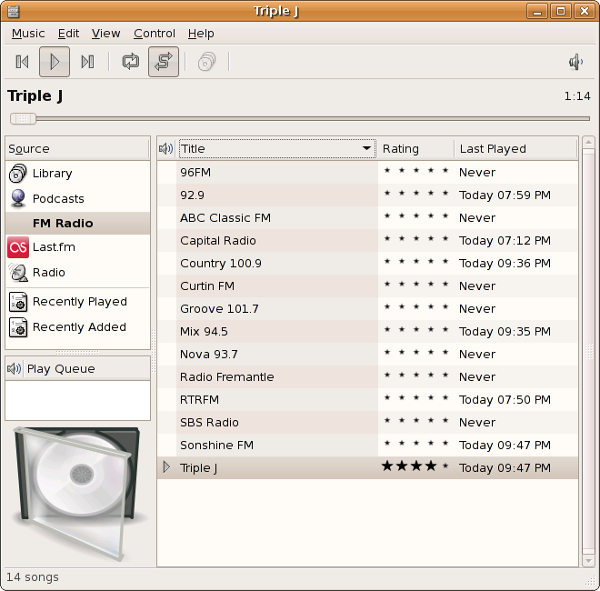

I\'ve been working on some FM radio support in Rhythmbox in my spare
time. Below is screenshot

At the moment, the basic tuning and mute/unmute works fine with my
DSB-R100. I don\'t have any UI for adding/removing stations at the
moment though, so it is necessary to edit
`~/.gnome2/rhythmbox/rhythmdb.xml` to add them.

---
### Comments:
#### Joel - <time datetime="2007-05-04 11:49:12">5 May, 2007</time>

This feature would truly be a welcome addition!

I\'m especially pleased it\'s being developed by a fellow Australian!
(If the radio stations are any indication)

---
#### Adam - <time datetime="2007-05-04 12:55:01">5 May, 2007</time>

RDS (Radio Data System) support would be great, since no other linux
radio program support it yet.

---
#### [James Henstridge](http://blogs.gnome.org/jamesh) - <time datetime="2007-05-04 14:19:53">5 May, 2007</time>

Adam: two things that make that a bit difficult: (1) my tuner device
doesn\'t have RDS capabilities, and (2) hardly any stations transmit RDS
data here anyway.

This isn\'t to say that someone else could do the work.

---
#### Adam - <time datetime="2007-05-04 14:32:49">5 May, 2007</time>

I personaly have an RDS tuner card (and here /Hungary/ there are a lots
of radio stations that sends RDS signals), so i would really like to
help (without the coding part).\
The only thing i know, is that the linux kernel does support RDS in some
way.

---
#### [Jonathan Carter](http://jonathancarter.co.za) - <time datetime="2007-05-04 16:13:32">5 May, 2007</time>

A station called RTRFM? What does the middle \"R\" stand for? ;)

---
#### [Ryan](http://www.cleardefinition.com/oss/abi/blog) - <time datetime="2007-05-04 16:24:34">5 May, 2007</time>

Would this theoretically be able to run on the N800, which contains an
FM tuner (now accessible only through a home page applet)?

---
####  - <time datetime="2007-05-04 21:34:12">5 May, 2007</time>

This looks awesome. If only I had a card that played FM audio\...

Joes wrote:\
\> I\'m especially pleased it\'s being developed by a fellow Australian!
(If the radio stations are any indication)

I wouldn\'t say it\'s too far out of the ordinary, as the two most
active contributors (moch and myself) are also both Australian.

---
#### Onkar - <time datetime="2007-05-05 03:59:27">6 May, 2007</time>

Will this be available as plugin so that user\'s who don\'t want to
install newer version of Rhythmbox can use it.\
I am currently on Feisty and I may go out and buy FM tuner soon if this
will work on existing Rhythmbox version.

---
#### [Nate](http://blog.glyphography.com) - <time datetime="2007-05-05 04:32:22">6 May, 2007</time>

Oh, that is excellent. Rhythmbox really needs this.And let\'s hope it
also helps to kill off the longstanding misnomer \"radio\" that RB uses
to refer to streaming audio. That misappropriation \*really\* needs to
go. Especially with HD Radio right around the corner; yet another audio
source that actually uses radio waves.

---
#### [mariuss](http://marius.scurtescu.com) - <time datetime="2007-05-05 04:38:43">6 May, 2007</time>

I was waiting for something like this!

Any plans to add support for RadioShark (2)?

Is the code available somewhere?

---
####  - <time datetime="2007-05-05 16:51:45">6 May, 2007</time>

Rhythmbox bug for the reference

<http://bugzilla.gnome.org/show_bug.cgi?id=168735>

---
