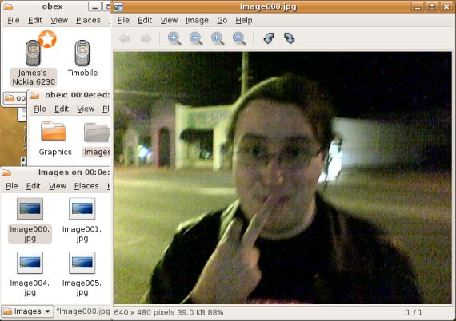

I put out a tarball release of gnome-vfs-obexftp here:

> <http://download.gnome.org/sources/gnome-vfs-obexftp/0.1/>

This includes a number of fixes since the work I did in October:

-   Fix up some error handling in the dbus code.
-   Mark files under the `obex:///` virtual root as being local. This
    causes Nautilus to process the desktop entries and give us nice
    icons.
-   Ship a copy of `osso-gwobex`, built statically into the VFS module.
    This removes the need to install another shared library only used by
    one application.

As well as the standard Gnome and D-BUS libraries, you will need
OpenOBEX \>= 1.2 and Bluez-Utils \>= 3.7. The `hcid` daemon must be
started with the `-x` flag to enable the experimental D-BUS interfaces
used by the VFS module. You will also need a phone or other device that
supports OBEX FTP `:)`

Last but not least, a screenshot:

**Update**

There was a build issue in the previous release caused by the
osso-gwobex headers not being found. I hadn\'t noticed it because I had
installed the library standalone. An updated tarball is available here:

> <http://download.gnome.org/sources/gnome-vfs-obexftp/0.2/>

---
### Comments:
#### Bjoern - <time datetime="2007-01-03 22:30:06">3 Jan, 2007</time>

Jeah, Great, fantastic, go for gnome 2.18\....

Thank you very much.

---
#### Ritesh Khadgaray - <time datetime="2007-01-03 23:46:26">3 Jan, 2007</time>

Error building\
Using FC6\
openobex-devel-1.3-3.1\
openobex-apps-1.3-3.1\
openobex-1.3-3.1\
bluez-utils-cups-3.7-2\
bluez-libs-3.7-1\
bluez-hcidump-1.32-1\
bluez-utils-3.7-2\
bluez-gnome-0.6-1.fc6\
bluez-libs-devel-3.7-1

gnome-vfs-obexftp-0.1 is not detecting the builtin osso-gwobex package.
am i doing something wrong ?

build log follows.\
\-\-\-\-\-\-\-\-\-\-\-\-\-\--

\$ make\
make all-recursive\
make\[1\]: Entering directory
\`/home/rkhadgar/share/gnome-vfs-obexftp-0.1\'\
Making all in osso-gwobex\
make\[2\]: Entering directory
\`/home/rkhadgar/share/gnome-vfs-obexftp-0.1/osso-gwobex\'\
make all-recursive\
make\[3\]: Entering directory
\`/home/rkhadgar/share/gnome-vfs-obexftp-0.1/osso-gwobex\'\
Making all in src\
make\[4\]: Entering directory
\`/home/rkhadgar/share/gnome-vfs-obexftp-0.1/osso-gwobex/src\'\
make\[4\]: Nothing to be done for \`all\'.\
make\[4\]: Leaving directory
\`/home/rkhadgar/share/gnome-vfs-obexftp-0.1/osso-gwobex/src\'\
Making all in test\
make\[4\]: Entering directory
\`/home/rkhadgar/share/gnome-vfs-obexftp-0.1/osso-gwobex/test\'\
make\[4\]: Nothing to be done for \`all\'.\
make\[4\]: Leaving directory
\`/home/rkhadgar/share/gnome-vfs-obexftp-0.1/osso-gwobex/test\'\
make\[4\]: Entering directory
\`/home/rkhadgar/share/gnome-vfs-obexftp-0.1/osso-gwobex\'\
make\[4\]: Nothing to be done for \`all-am\'.\
make\[4\]: Leaving directory
\`/home/rkhadgar/share/gnome-vfs-obexftp-0.1/osso-gwobex\'\
make\[3\]: Leaving directory
\`/home/rkhadgar/share/gnome-vfs-obexftp-0.1/osso-gwobex\'\
make\[2\]: Leaving directory
\`/home/rkhadgar/share/gnome-vfs-obexftp-0.1/osso-gwobex\'\
Making all in docs\
make\[2\]: Entering directory
\`/home/rkhadgar/share/gnome-vfs-obexftp-0.1/docs\'\
make\[2\]: Nothing to be done for \`all\'.\
make\[2\]: Leaving directory
\`/home/rkhadgar/share/gnome-vfs-obexftp-0.1/docs\'\
Making all in src\
make\[2\]: Entering directory
\`/home/rkhadgar/share/gnome-vfs-obexftp-0.1/src\'\
if /bin/sh ../libtool \--tag=CC \--mode=compile gcc -DHAVE\_CONFIG\_H
-I. -I. -I.. -D\_FILE\_OFFSET\_BITS=64 -D\_BSD\_SOURCE
-D\_LARGEFILE64\_SOURCE -D\_POSIX\_PTHREAD\_SEMANTICS -pthread
-DORBIT2=1 -I/usr/include/glib-2.0 -I/usr/lib/glib-2.0/include
-I/usr/include/dbus-1.0 -I/usr/lib/dbus-1.0/include
-I/usr/include/gnome-vfs-2.0 -I/usr/lib/gnome-vfs-2.0/include
-I/usr/include/gconf/2 -I/usr/include/orbit-2.0
-I/usr/include/gnome-vfs-module-2.0 -g -O2 -Wall -std=c89 -Wcast-align
-Wsign-compare -Wnested-externs -Wpointer-arith -Wchar-subscripts
-Wmissing-declarations -Wmissing-prototypes -Wno-strict-aliasing
-Wno-sign-compare -Wdeclaration-after-statement -MT obex-method.lo -MD
-MP -MF \".deps/obex-method.Tpo\" -c -o obex-method.lo obex-method.c;
\\\
then mv -f \".deps/obex-method.Tpo\" \".deps/obex-method.Plo\"; else rm
-f \".deps/obex-method.Tpo\"; exit 1; fi\
gcc -DHAVE\_CONFIG\_H -I. -I. -I.. -D\_FILE\_OFFSET\_BITS=64
-D\_BSD\_SOURCE -D\_LARGEFILE64\_SOURCE -D\_POSIX\_PTHREAD\_SEMANTICS
-pthread -DORBIT2=1 -I/usr/include/glib-2.0 -I/usr/lib/glib-2.0/include
-I/usr/include/dbus-1.0 -I/usr/lib/dbus-1.0/include
-I/usr/include/gnome-vfs-2.0 -I/usr/lib/gnome-vfs-2.0/include
-I/usr/include/gconf/2 -I/usr/include/orbit-2.0
-I/usr/include/gnome-vfs-module-2.0 -g -O2 -Wall -std=c89 -Wcast-align
-Wsign-compare -Wnested-externs -Wpointer-arith -Wchar-subscripts
-Wmissing-declarations -Wmissing-prototypes -Wno-strict-aliasing
-Wno-sign-compare -Wdeclaration-after-statement -MT obex-method.lo -MD
-MP -MF .deps/obex-method.Tpo -c obex-method.c -fPIC -DPIC -o
.libs/obex-method.o\
obex-method.c:30:21: error: gw-obex.h: No such file or directory\
\....

---
#### Frank Oosterhuis - <time datetime="2007-01-03 23:50:45">3 Jan, 2007</time>

Got it working thanks to the -x parameter to hcid :)

---
#### Sindre Bjørdal - <time datetime="2007-01-04 02:46:02">4 Jan, 2007</time>

Build fails here, Fedora Core 6:

make all-recursive\
make\[1\]: Entering directory
\`/home/build/rpmbuild/BUILD/gnome-vfs-obexftp-0.1\'\
Making all in osso-gwobex\
make\[2\]: Entering directory
\`/home/build/rpmbuild/BUILD/gnome-vfs-obexftp-0.1/osso-gwobex\'\
make all-recursive\
make\[3\]: Entering directory
\`/home/build/rpmbuild/BUILD/gnome-vfs-obexftp-0.1/osso-gwobex\'\
Making all in src\
make\[4\]: Entering directory
\`/home/build/rpmbuild/BUILD/gnome-vfs-obexftp-0.1/osso-gwobex/src\'\
if /bin/sh ../libtool \--tag=CC \--mode=compile gcc -DHAVE\_CONFIG\_H
-I. -I. -I.. -I. -pthread -I/usr/include/glib-2.0
-I/usr/lib/glib-2.0/include -O2 -g -pipe -Wall -Wp,-D\_FORTIFY\_SOURCE=2
-fexceptions -fstack-protector \--param=ssp-buffer-size=4 -m32
-march=i386 -mtune=generic -fasynchronous-unwind-tables -Wall -Wunused
-Wchar-subscripts -Wmissing-declarations -Wmissing-prototypes
-Wnested-externs -Wpointer-arith -Wno-sign-compare -Werror -MT
obex-priv.lo -MD -MP -MF \".deps/obex-priv.Tpo\" -c -o obex-priv.lo
obex-priv.c; \\\
then mv -f \".deps/obex-priv.Tpo\" \".deps/obex-priv.Plo\"; else rm -f
\".deps/obex-priv.Tpo\"; exit 1; fi\
gcc -DHAVE\_CONFIG\_H -I. -I. -I.. -I. -pthread -I/usr/include/glib-2.0
-I/usr/lib/glib-2.0/include -O2 -g -pipe -Wall -Wp,-D\_FORTIFY\_SOURCE=2
-fexceptions -fstack-protector \--param=ssp-buffer-size=4 -m32
-march=i386 -mtune=generic -fasynchronous-unwind-tables -Wall -Wunused
-Wchar-subscripts -Wmissing-declarations -Wmissing-prototypes
-Wnested-externs -Wpointer-arith -Wno-sign-compare -Werror -MT
obex-priv.lo -MD -MP -MF .deps/obex-priv.Tpo -c obex-priv.c -fPIC -DPIC
-o .libs/obex-priv.o\
cc1: warnings being treated as errors\
obex-priv.c: In function \'obex\_readstream\':\
obex-priv.c:384: warning: ignoring return value of \'write\', declared
with attribute warn\_unused\_result\
make\[4\]: \*\*\* \[obex-priv.lo\] Error 1\
make\[4\]: Leaving directory
\`/home/build/rpmbuild/BUILD/gnome-vfs-obexftp-0.1/osso-gwobex/src\'\
make\[3\]: \*\*\* \[all-recursive\] Error 1\
make\[3\]: Leaving directory
\`/home/build/rpmbuild/BUILD/gnome-vfs-obexftp-0.1/osso-gwobex\'\
make\[2\]: \*\*\* \[all\] Error 2\
make\[2\]: Leaving directory
\`/home/build/rpmbuild/BUILD/gnome-vfs-obexftp-0.1/osso-gwobex\'\
make\[1\]: \*\*\* \[all-recursive\] Error 1\
make\[1\]: Leaving directory
\`/home/build/rpmbuild/BUILD/gnome-vfs-obexftp-0.1\'\
make: \*\*\* \[all\] Error 2\

---
#### [Ed Catmur](http://ed.catmur.co.uk) - <time datetime="2007-01-04 12:54:14">4 Jan, 2007</time>

re Ritesh\'s bug, this is the patch I\'m using:

\-\-- src/Makefile.am 2007/01/04 01:52:34 1.1\
+++ src/Makefile.am 2007/01/04 01:53:50\
@@ -3,6 +3,7 @@ INCLUDES =\
-D\_BSD\_SOURCE \\\
-D\_LARGEFILE64\_SOURCE \\\
-D\_POSIX\_PTHREAD\_SEMANTICS \\\
+ -I\$(top\_builddir)/osso-gwobex/src \\\
\$(OBEX\_MODULE\_CFLAGS) \\\
\$(XML\_CFLAGS)\
\

---
#### Ritesh Khadgaray - <time datetime="2007-01-09 02:50:20">2 Jan, 2007</time>

additonally, for some reason the file below was never created :( . did
the same manually.\
/etc/gnome-vfs-2.0/modules/obex-modules.conf

---
#### [James Henstridge](http://blogs.gnome.org/jamesh) - <time datetime="2007-01-09 15:34:53">2 Jan, 2007</time>

Ritesh: the file probably got installed in
\$prefix/etc/gnome-vfs-2.0/modules, since the default value of
sysconfdir is \$prefix/etc.

If you pass \--sysconfdir=/etc to configure, that should solve the
problem (this is the same sysconfdir that was configured for gnome-vfs).

---
#### Ritesh Khadgaray - <time datetime="2007-01-10 00:34:12">3 Jan, 2007</time>

Duh ! thanks James.\

---
#### Daniel - <time datetime="2007-01-13 11:46:48">6 Jan, 2007</time>

There is something I must\'ve done wrong.

Typing obex:/// in Nautilus does bring up an icon of my phone. However,
when I click on it, it does the pairing (asking for pin and such, the
telephone asks me TWICE if I want to accept the connection which I do
accept both times), and in the end, nothing happens at all.

---
#### Daniel - <time datetime="2007-01-13 11:49:14">6 Jan, 2007</time>

I typed the location of the phone (obex://\[00:16:4E:D0:06:D5\]/)
directly into Nautilus, which said that it can\'t display the location,
and I should choose another viewer.

I have a Nokia N70.

---
#### Daniel - <time datetime="2007-01-13 23:05:30">6 Jan, 2007</time>

Okay, problem partly understood. I managed to get a real access to my
phone over obexftp - a Nokia N70 absolutely NEEDS to be accessed on
bluetooth channel 12 (-B 12) for real FTP access.

However, I have no idea how to tell vfs-obexftp about this. Where do I
insert the channel number?

---
#### [James Henstridge](http://blogs.gnome.org/jamesh) - <time datetime="2007-01-14 02:02:08">0 Jan, 2007</time>

Daniel: there is already some special case code for Nokia smartphones in
the code, since they export a crippled FTP implementation for the
standard service UUID.

Before trying to connect using the standard FTP service, it tries a
Nokia specific service UUID, which should function correctly. I don\'t
have the hardware necessary to test this though (my 6230 doesn\'t
implement this second service).

---
#### Alex Kanavin - <time datetime="2007-01-14 16:08:43">0 Jan, 2007</time>

Just did a quick testing on FC6 with the Nokia 6680 I have. It works
nicely but there are some problems:\
1) The obex:/// list was initially empty. I explicitly opened the phone
location (MAC address), then the pairing procedure happened and after
that the phone icon showed up in obex:/// list. Shouldn\'t there be some
sort of proximity scan?\
2) If I switch bluetooth off on the phone, the phone icon does not
disappear. Again, the list should reflect the current proximity.\
3) Clicking on the phone icon is not very stable, sometimes it produces
a dialog box with a generic \'can\'t open\' error. It might be the
phone\'s problem though.\
4) phone\'s MAC address should only be visible through properties. Human
friendly names should be used everywhere else.

I\'d be glad to do further testing. I\'ll also have a look at adding USB
support.

---
#### Alex Kanavin - <time datetime="2007-01-17 01:34:34">3 Jan, 2007</time>

Some info from Marcel Holtmann, the OpenOBEX maintainer:\
osso-gwobex should be replaced by OpenOBEX GLib bindings, but actually
they are not ready yet. File transfer functionality can be included
directly into the bindings but\
someone has to write it.

---
#### Ritesh Khadgaray - <time datetime="2007-01-17 13:00:01">3 Jan, 2007</time>

Sounds stupid. But i have send obexftpd app on my motorola a1200, but
strangely nothing seems to pop-up with obex:///

.

---
#### [Mike Edwards](http://a.parsons.edu/~medwards) - <time datetime="2007-01-17 17:12:47">3 Jan, 2007</time>

I\'m having the almost the same trouble as Daniel with my Nokia N80,
though mine is actually a bit worse. I can get files moved around using
obexftp using channel 12 on Ubuntu 6.10 (Edgy Eft), but I keep getting:

Nautilus cannot display obex:///\
Please select another viewer and try again.

This happens no matter whether I type the MAC directly or just start
with obex:///

I have the right OpenOBEX and Bluez-utils packages, and I modified my
bluetooth startup script to have hcid start with the -x flag. No joy,
though. Any ideas?

---
#### Alex Kanavin - <time datetime="2007-01-17 21:48:20">3 Jan, 2007</time>

Mike: are your obex-modules.conf and \*.so libraries in the right
places? By default they get installed in /usr/local and gnome won\'t
pick them up.

---
#### [Jonh Wendell](http://www.bani.com.br) - <time datetime="2007-01-18 03:27:27">4 Jan, 2007</time>

There is no support for USB connections? I\'m using latest version
(0.2).

Thanks,\
Wendell.

---
#### [Mike Edwards](http://a.parsons.edu/~medwards) - <time datetime="2007-01-25 18:51:48">4 Jan, 2007</time>

Aha! That did it. I had copied the obex-module.conf file to the right
directory before, but the .so file were still wrong. I re-built using
./configure \--prefix=/usr \--sysconfdir=/etc and that did it!

Now I have it working\...sort of. It shows my phone (Nokia N80) and I
can click into it and navigate around for a little while. But after
about a minute or so, it stops being able to navigate around and gives
me this error:

Couldn\'t display folder \"XYZ/ABC\"

Sometimes it recovers, sometimes not. It\'s still a little flaky, in
general. Just the same, it\'s a really great leap forward for Bluetooth
on Linux, and it\'s already looking like it will be a pretty helpful
addition to Gnome.

---
#### [klerik](http://linuxgames.cz) - <time datetime="2007-02-04 05:37:46">0 Feb, 2007</time>

Hi,i have Arch Linux and Nokia 5500 Sport, i compile gnome-vfs-obexftp
witch ./configure \--prefix=/opt/gnome \--sysconfdir=/etc. And i have
the same problem as Daniel, if i write to Nautilus \"obex://\" is window
empty, so i write obex://\[XX:XX:XX:XX:XX:X\], my phone say connection
and on console log on command \"hcid -x -n\" is \"hcid\[22677\]: Connect
in progress\". Nautilus say \"Please select another viewer and try
again.\"I try my phone on another PC with Kubuntu 6.10 and everything is
OK and works.Pleas help me. I like Gnome :).PS: sorry for bad english
;-)

---
