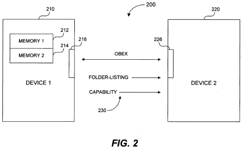

I recently received a [bug
report](https://bugs.launchpad.net/gnome-vfs-obexftp/+bug/116912) about
the free space calculation in
[gnome-vfs-obexftp](https://launchpad.net/gnome-vfs-obexftp). At the
moment, the code exposes a single free space value for the OBEX
connection. However, some phones expose multiple volumes via the virtual
file system presented via OBEX.

It turns out my own phone does this, which was useful for testing. The
Nokia 6230 can store things on the phone's memory (named `DEV` in the
OBEX capabilities list), or the Multimedia Card (named `MMC`). So the
fix would be to show the `DEV` free space when browsing folders on `DEV`
and the `MMC` free space when browsing folders on `MMC`.

Doing a bit of investigation, I found that the information I wanted was
in the folder listings:

    <?xml version="1.0"?>
    <!DOCTYPE folder-listing SYSTEM "obex-folder-listing.dtd"
     [ <!ATTLIST folder mem-type CDATA #IMPLIED> ]>
    <folder-listing version="1.0">
        <folder name="Memory card" user-perm="RW" mem-type="MMC"/>
        <folder name="Images" created="19800101T000008" user-perm="R" mem-type="DEV"/>
        ...
    </folder-listing>

I took a look through the OBEX specification, and this `mem-type` wasn't
defined. So it looked like a Nokia extension. Doing a quick search, the
closest I came to a describing it was [US patent application
\#20060095537](http://www.freepatentsonline.com/20060095537.html "Memory association to folder information").

So Nokia is effectively trying to patent an XML attribute. I'd seen a
lot of bad patents, but this seemed particularly weak. The patent
application even comes with a useful diagram explaining the invention:

As far as I can tell, using the information returned from the phone
wouldn't be covered by the patent (if it gets issued, that is). So it
should be fine to use the information to calculate free space more
accurately.

---
### Comments:
#### [Colin Walters](http://cgwalters.livejournal.com) - <time datetime="2007-06-01 00:09:31">5 Jun, 2007</time>

The first word in the title here is redundant =)

But that one is particularly good for sure.

---
