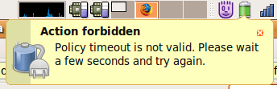

Since upgrading to [Ubuntu Gutsy](https://wiki.ubuntu.com/GutsyGibbon)
I\'ve occasionally been seeing the following notification from GNOME
Power Manager:

I\'d usually trigger this error by unplugging the AC adapter and then
picking suspend from GPM\'s left click menu.

My first thought on seeing this was \"What\'s a policy timeout, and why
is it not valid?\" followed by \"I don\'t remember setting a policy
timeout\". Looking at [bug
492132](http://bugzilla.gnome.org/show_bug.cgi?id=492132) I found a
pointer to the `policy_suppression_timeout` gconf value, whose
description gives a bit more information.

Apparently the timeout is designed to ignore spurious messages from the
hardware after a resume \-- you wouldn\'t want to process a left over
\"suspend\" message immediately after resuming from suspend after all.
This does bring up a few questions though:

1.  While ignoring \"please suspend\" messages shortly after performing
    a suspend makes sense, why ignore \"please suspend\" messages after
    an \"on battery power message\"?
2.  While messages from the hardware might be spurious, surely picking
    an option from GPM\'s menu is not. I guess such suspend requests are
    being mixed in with hardware suspend requests before the point where
    the policy timeout is checked.

---
### Comments:
#### [Chris Cunningham](http://blondechris.com) - <time datetime="2007-11-19 18:26:27">1 Nov, 2007</time>

IIRC Richard Hughes has said in the past that warnings like this aren\'t
really his forte and that he\'s open to suggestions of improvement. This
is pretty obviously not something which is optimal right now.

\- Chris

---
#### [mark](http://blog.markvdb.be) - <time datetime="2007-11-19 19:55:20">1 Nov, 2007</time>

Hm, exactly this message is what I get about one time in five, and then
my keyboard and mouse stop responding after about a second\...

---
