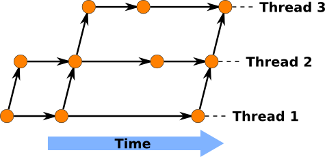

While doing a bit of work on [Storm](http://storm.canonical.com/), I
decided to try out the [loom plugin for
Bazaar](https://launchpad.net/bzr-loom). The loom plugin is designed to
help maintain a stack of changes to a base branch (similar to
[quilt](http://savannah.nongnu.org/projects/quilt)). Some use cases
where this sort of tool are useful include:

1.  Maintaining a long-running diff to a base branch. Distribution
    packaging is one such example.
2.  While developing a new feature, the underlying code may require some
    refactoring. A loom could be used to keep the refactoring separate
    from the feature work so that it can be merged ahead of the feature.
3.  For complex features, code reviewers often prefer to changes to be
    broken down into a sequence of simpler changes. A loom can help
    maintain the stack of changes in a coherent fashion.

A loom branch helps to manage these different threads in a coherent
manner. Each thread in the loom contains all the changes from the
threads below it, so the revision graph ends up looking something like
this:

Once the plugin has been installed, a normal branch can be converted to
a loom with the \"`bzr loomify`\" command. The \"`bzr create-thread`\"
command can be used to create a new thread above the current one.

The \"`bzr down-thread`\" and \"`bzr up-thread`\" commands can be used
to switch between threads. When going up a thread, a merge will be
performed if there are new changes from the lower thread. The
\"`bzr show-loom`\" command shows the current state of the loom, and
which thread is currently selected.

The \"`bzr export-loom`\" command can be used to explode the loom,
creating a standard branch for each thread. The included HOWTO document
gives a more detailed tutorial.

There are a few warts in the UI that I\'ve encountered though:

1.  The \"`bzr combine-thread`\" command sounds like it should actually
    merge two threads. Instead it is an advisory command that can be
    used to remove a thread once its contents have been merged.
2.  After pulling new changes in from upstream on the bottom thread, it
    gets a bit tedious bubbling the changes up with \"`bzr up-thread`\"
    and \"`bzr commit`\".
3.  As well as committing revisions to individual threads, the
    \"`bzr record`\" command can be used to commit the state of the loom
    as a whole. I haven\'t really worked out when I should be using the
    command.
4.  No indication is given if there are changes in the loom that
    haven\'t been recorded with \"`bzr record`\". I\'d expect some
    indication from \"`bzr status`\" to this effect.
5.  When using looms to break a larger feature down into smaller chunks,
    it\'d be nice to have a command that generated a sequence of merge
    requests that built on top of each other. This would be the form
    needed to submit them for review on a mailing list.

Despite the quirks in the interface, it does make the relevant work
flows easier.  It will be interesting to see how the plugin develops.
