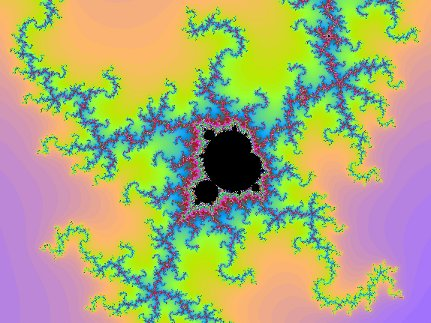

While at linux.conf.au earlier this year, I started hacking on a
Mandelbrot Set fractal renderer implemented in JavaScript as a way to
polish my JS skills.  In particular, I wanted to get to know the HTML5
[Canvas](http://en.wikipedia.org/wiki/Canvas_element) and
[Worker](http://en.wikipedia.org/wiki/Web_Workers) APIs.

The results turned out pretty well.  Click on the image below to try it
out:

Clicking anywhere on the fractal will zoom in.  You\'ll need to reload
the page to zoom out.  Zooming in while the fractal is still being
rendered will interrupt the previous rendering job.

All the calculations are done via web workers, so should not block the
UI.  The algorithms used to calculate these types of fractals are easy
to parallelise, so it was not particularly difficult to add more
workers.  One side effect of this is that the lines of the fractal
don\'t always get rendered in order.

With [Chromium](http://www.chromium.org/Home), this maxes out all six
cores on my desktop system.  In contrast,
[Firefox](http://www.mozilla.com/firefox/) only keeps three cores busy. 
As workers are not directly tied to operating system threads, this may
just mean that Firefox allocates fewer threads for running workers.  I
haven\'t tested any other browsers.

Browser technology certainly has progressed quite a bit in the last few
years.

---
### Comments:
#### Andy Wingo - <time datetime="2011-03-08 14:38:53">2 Mar, 2011</time>

Pretty cool. I wonder how this performance compares to, say, Python.
(Guile in my case; they are similar.)

I would be surprised if JS didn\'t roundly beat Python or Guile on this
one.

---
#### [James Henstridge](http://blogs.gnome.org/jamesh/) - <time datetime="2011-03-08 15:04:02">2 Mar, 2011</time>

One thing I didn\'t measure (and don\'t really have a good way to
measure) was the message passing overhead. The web worker specification
says that the objects passed in messages between workers have to be
serialisable as JSON.

This is because workers run in different interpreter instances to the
main thread and the implementation won\'t necessarily let you migrate
objects between instances. So it is likely that some period of time is
being spent on JSON encode/decode for each line generated.

If an alternative language has more efficient message passing, then that
might let it beat the JavaScript implementation.

---
#### Roumano - <time datetime="2011-03-08 15:36:24">2 Mar, 2011</time>

It\'s funny, but not seem\'s to be a real fractal as after some level of
zoom (\~ 15) the picture is Pixelise \...

---
#### [James Henstridge](http://blogs.gnome.org/jamesh/) - <time datetime="2011-03-09 00:24:06">3 Mar, 2011</time>

\@Roumano: I think that is just a case of hitting the precision limit
for the floating point type used by the interpreter. I\'m not using any
special high precision arithmetic library, so it isn\'t surprising that
that happens.

---
#### foo - <time datetime="2011-03-09 05:21:42">3 Mar, 2011</time>

Hmm, if you implemented it more like Xaos it might be faster and nicer.

---
#### Hans - <time datetime="2011-03-09 06:57:12">3 Mar, 2011</time>

Pretty neat, a minor enhancement would be to start drawing lines up and
down starting from where the user clicked, so you can immediately
pinpoint where you are and click again if you can already see where you
want to go next (instead of waiting for the whole thing to render). But
I guess usuability wasnt the point of this demo :p

---
#### [James Henstridge](http://blogs.gnome.org/jamesh/) - <time datetime="2011-03-10 03:28:02">4 Mar, 2011</time>

\@foo: it isn\'t surprising that a native code implementation runs
faster. I was doing this more as a way to practice parallel programming
in the context of browsers.

\@Hans: I guess that would make things a bit nicer to use. It would
probably only take a function to remap the value of the line counter
when sending jobs to the workers.

---
#### [Eric Freeman](http://www.ericfreeman.com) - <time datetime="2011-04-20 12:19:55">3 Apr, 2011</time>

Looks great, and nice code. With safari I\'m maxing out 8 cores. Nice.

Eric

---
#### [Jake](http://www.jakebakermaths.org.uk) - <time datetime="2011-04-23 03:37:28">6 Apr, 2011</time>

Hi, I really like your mandelbrot. I\'ve done one recently in javascript
in xhtml with svg, which works on Chrome and IE9 but is too intensive
for Firefox. Mine is slower than yours. I haven\'t learnt \'canvas\' but
you\'ve got great results with it. For some reason I was getting the
impression that canvas wasn\'t supported by many browsers, but on my
computer your version works fine on Chrome and FF. I didn\'t use
multiple precision arithmetic either, because I think the limits are
imposed more by the iteration max (I used 2000, I think you used 1024),
and the consequent calculation speeds, than the depth of zoom. Jake.

---
#### [Eric Freeman](http://www.ericfreeman.com) - <time datetime="2011-04-28 11:16:29">4 Apr, 2011</time>

James can you contact me directly? I have a question for you (about
publishing some of your code).

Thanks,

Eric

---
#### [Eric Freeman](http://www.ericfreeman.com) - <time datetime="2011-04-28 11:17:14">4 Apr, 2011</time>

Jake, canvas is now widely supported by pretty much all modern browsers.

Eric

---
#### [James Henstridge](http://blogs.gnome.org/jamesh/) - <time datetime="2011-04-28 11:37:38">4 Apr, 2011</time>

\@Jake: I\'d imagine the SVG method would be a fair bit slower and more
memory hungry, since you\'re asking the browser to create a DOM node for
each pixel in the image, while with the canvas I just need to update the
RGB image data associated with the single canvas element. You could
still apply web workers to parallelise the calculation in your
implementation.

While there are areas that are obviously lacking detail due to the
iteration limit I set, there are other areas of the image where I hit
the floating point precision limit first and the image becomes blocky. I
imagine you could find areas in your version that exhibit this.

---
#### [Jake](http://jakebakermaths.org.uk) - <time datetime="2011-04-28 15:17:03">4 Apr, 2011</time>

Thanks James and Eric for your comments, it\'s helpful to understand
some of these speed issues. I\'ll get working on learning canvas.

Jake

---
#### [Jake](http://www.jakebakermaths.org.uk) - <time datetime="2011-05-08 02:36:43">0 May, 2011</time>

Hi James,

I now have learned enough about Canvas to re-do my Mandelbrot generator
using it. It is much faster, and I\'m pleased with the result. I don\'t
know about web workers (I\'m only a maths teacher), maybe that\'s the
next step. In case you want to try my Mandelbrot, here it is:
http://www.jakebakermaths.org.uk/maths/mandelbrot/canvasmandelbrotv12.html.
It works on Chrome, Firefox and IE9; I don\'t know about Safari or
Opera.

Jake.

---
#### alex_mass - <time datetime="2011-05-17 20:23:37">2 May, 2011</time>

Hi James,

thanks for the post\
I slightly derived your code to try to make it more \"education ready\".

http://www.framexpeditions.com/\~alex2/teaching/mandelbrot/

Alex

---
