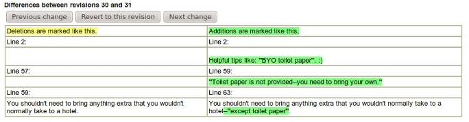

I\'ve just got through the first one and a half days of
[LCA2011](http://linux.conf.au/) in Brisbane. The organisers have done a
great job, especially considering the
[flooding](http://en.wikipedia.org/wiki/2010%E2%80%932011_Queensland_floods "2010–2011 Queensland floods")
they have had to deal with.

Due to the venue change the accommodation I booked is no longer within
walking distance of the conference, but the public transport is pretty
good.  A bit more concerning was the following change to the wiki made
between the time I left Perth and the time I checked in:

\[caption id=\"attachment\_463\" align=\"aligncenter\" width=\"684\"
caption=\"BYO Toilet
Paper\"\]{.size-full
.wp-image-463 width="684" height="179"}\[/caption\]

I\'ve been impressed with the conference talks I\'ve been to so far. In
particular, I liked Silvia Pfeiffer\'s talk on audio/video processing
with HTML5 -- I\'ll have to have a play with some of this. Today\'s
keynote was by [Vint Cerf](http://en.wikipedia.org/wiki/Vint_Cerf) about
the history of internet protocols and what the challenges will be in the
future (e.g. [InterPlaNet](http://en.wikipedia.org/wiki/InterPlaNet)).

There was a talk today about [Redis](http://redis.io/): it sounded like
interesting technology, but the talk didn\'t really give enough
information to say when you\'d choose it over other systems.
