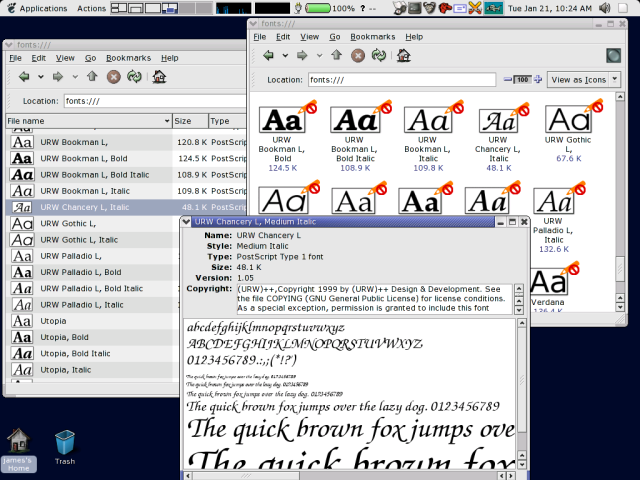

Fontilus was a set of extensions for the Nautilus file manager,
enabling various font management tasks via the
[fontconfig](http://fontconfig.org/) system.

<!--more-->

It consists of the following components:

* A fonts folder accessible as `fonts:`.  This folder lists all
  the fonts visible to fontconfig.

* Thumbnails for font files.  This helps when scanning through lists
  of fonts in both [icon view](fontilus-thumb-icons.png) and [list
  view](fontilus-thumb-list.png).

* A simple [font viewer](fontilus-font-viewer.png) application to
  preview fonts.

* A [context menu item](fontilus-context-menu.png) to allow setting
  the default application font to one of the fonts in `fonts:`.

Here is a screenshot showing the various components running together:

## Downloads

Fontilus can be downloaded from ftp.gnome.org and its mirrors:

https://download.gnome.org/sources/fontilus/

Parts of fontilus were used in the more recent
[gnome-font-viewer](https://gitlab.gnome.org/GNOME/gnome-font-viewer).
