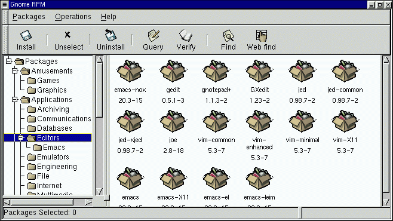

GnoRPM is a graphical front end to the [RPM package management
system](http://rpm.org/).  I was the initial author and maintained it
up til the end of 1999 (around the 0.9 release).  It shipped as the
graphical package manager for Red Hat Linux from versions 6.0 to 7.3.

<!--more-->

A screenshot of an earlier version can be found [here](gnorpm-0.6.gif).

Source code for GnoRPM can be found here:

https://download.gnome.org/sources/gnorpm/

Note that GnoRPM is targetted at the GNOME 1.x platform, and doesn't
support the latest versions of RPM.  For GNOME 2.x systems, I started
working on [Nautilus RPM]() as a replacement, but its feature set is much more limited.
