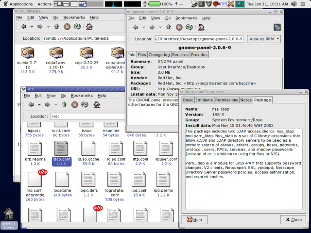

Nautilus RPM was a set of extensions for the Nautilus file manager to
help manage packages on an [RPM](http://www.rpm.org/) based system.

<!--more-->

I started working on it as a replacement for [GnoRPM]() on GNOME 2.x systems, but never
completed it.

Nautilus-RPM can be downloaded from ftp.gnome.org and its mirrors:

https://download.gnome.org/sources/nautilus-rpm/
